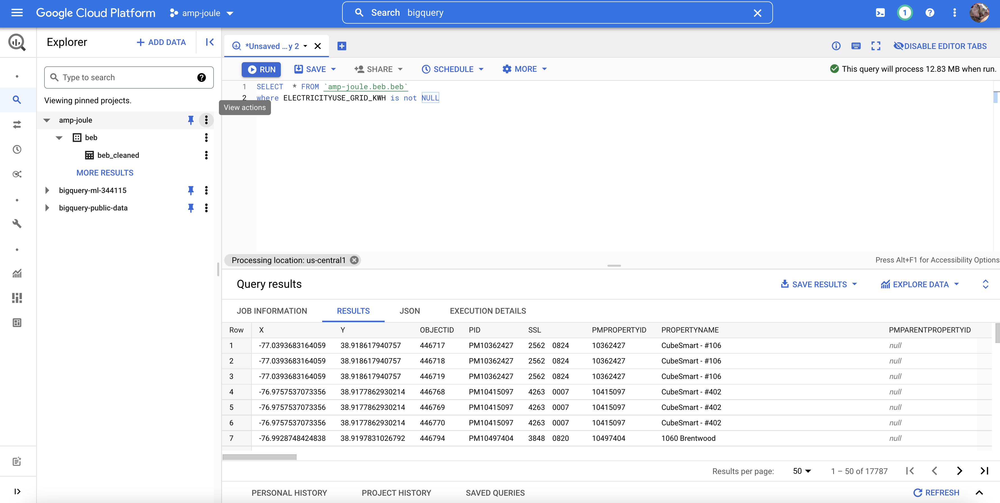
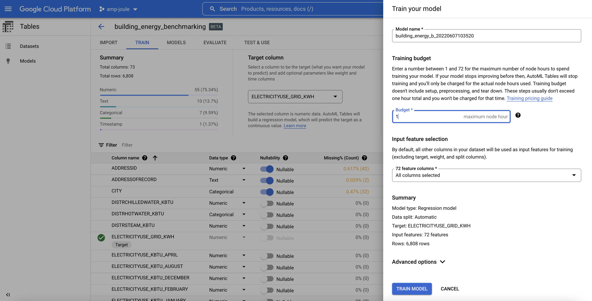
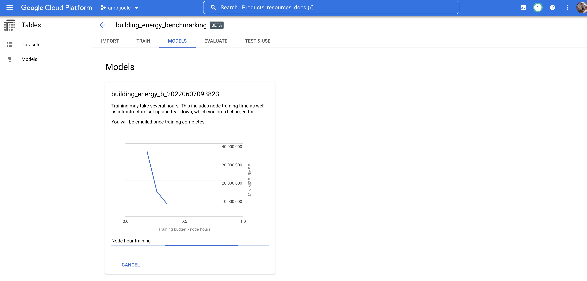
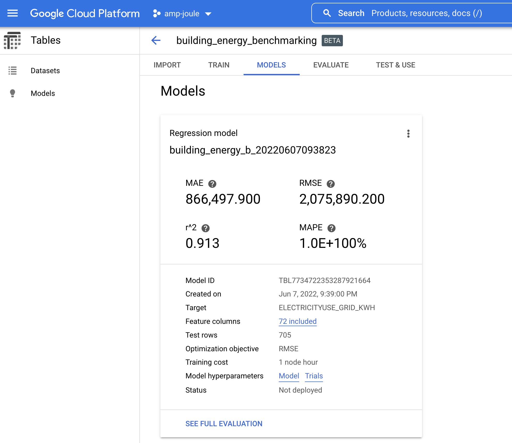
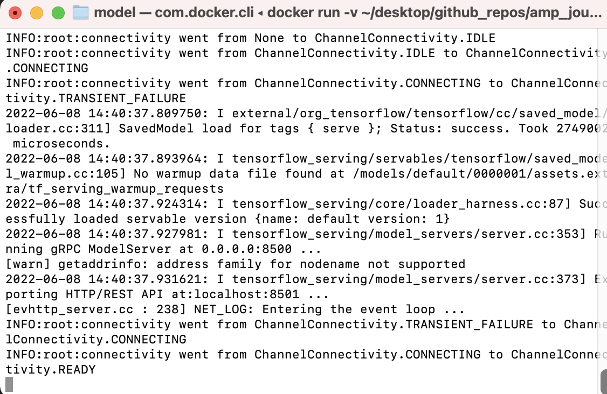
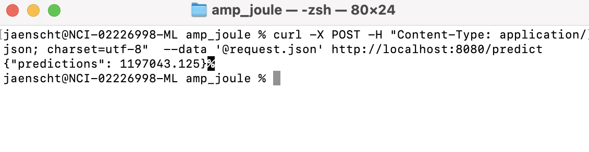

# Amp Joule
ML demo app

## Overview

- Downloaded https://opendata.dc.gov/datasets/DCGIS::building-energy-benchmarking/ in CSV format and assessed data table, decided to build a regression model with "ELECTRICITYUSE_GRID_KWH" as the target column (rather random choice without much SME expertise, just for demo purposes)

- Used GCP's BigQuery service to clean the table and remove any rows from the data where the target column was NULL since GCP's Auto ML Tables doesn't work when there are NULL values for the target column to be predicted (this is a brute force approach because of time and demo constraints, more sophisticated would be imputing missing values, etc.)


- Trained model with GCP's Auto ML Tables on all 72 input columns which does a lot of data science & ML work behind the scenes (like one-hot-encoding of categorical features, feature engineering, ensemble methods, etc.) that would take tons of experimentation and time to replicate manually




- Exported AutoML TensorFlow model into `model` directory

## Usage

- Clone repository and then CD into model folder and run this command to start the model server:
```
docker run -v `pwd`/model-export/tbl/tf_saved_model-building_energy_benchmark:/models/default/0000001 -p 8080:8080 -it gcr.io/cloud-automl-tables-public/model_server
```

If successful, the CLI output will look like this:


- In another terminal window, run this command to make predictions:
```
curl -X POST -H "Content-Type: application/json; charset=utf-8"  --data '@request.json' http://localhost:8080/predict
```
